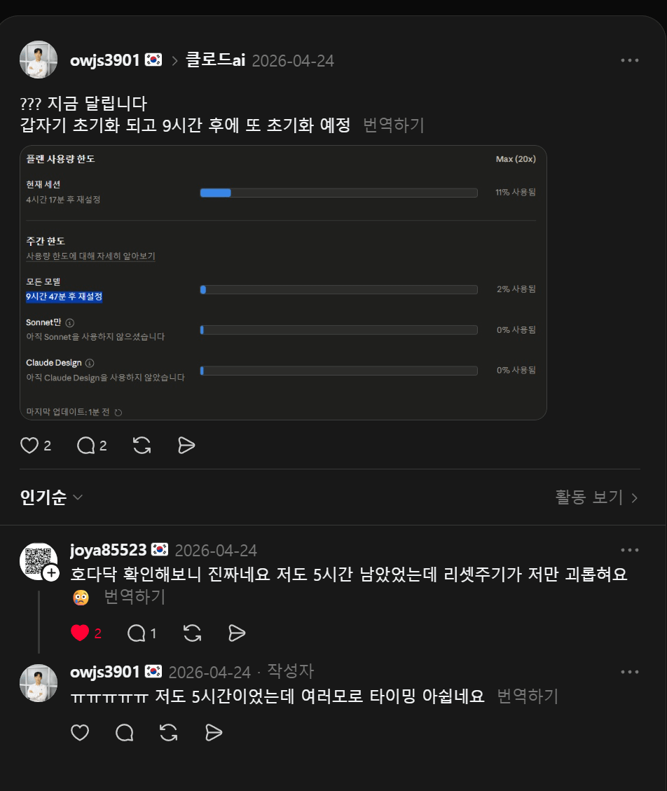

# Threads Country Badge

<p align="center">
  
</p>

<p align="center">
  <strong>Make Threads feeds easier to read by placing country context directly beside each author.</strong>
</p>

<p align="center">
  <a href="#features">Features</a> ·
  <a href="#how-it-works">How it works</a> ·
  <a href="#development">Development</a> ·
  <a href="#release">Release</a>
</p>

## Overview

Threads Country Badge is a Chrome Manifest V3 extension that annotates Threads feed and comment authors with a country flag, country name, or both. The badge appears inline next to the profile link, so the feed keeps its native rhythm while adding the context you would normally need to open a profile to find.

The extension is designed for real Threads sessions: it runs in the page, observes profile-related requests, extracts country signals from Threads' own profile data, and caches results locally for fast repeat rendering.

## Features

- **Inline country badges** — show a flag or country label directly beside Threads usernames.
- **Feed and reply support** — works across visible profile links in feeds, comments, and replies.
- **Smart profile resolution** — captures Threads profile/about-profile data from the active page session.
- **Local caching** — avoids repeated profile lookups for authors that were already resolved.
- **Configurable display** — choose flag-only, country-only, or flag + country modes from the options page.
- **MV3-ready architecture** — uses a service worker, isolated content script, and MAIN-world injected script where each is needed.
- **Release-safe workflow** — changepacks versioning, manifest version checks, Husky pre-commit hooks, and Chrome Web Store GitHub Actions deployment.

## How it works

1. `src/injected.ts` runs in the MAIN world to observe Threads requests and collect profile/user-id signals from the active browser session.
2. `src/content.ts` scans visible Threads profile links, places inline badge elements, and requests country resolution.
3. Country data is normalized through shared parsing and country lookup logic.
4. Results are cached in Chrome storage and reused in memory for fast scrolling and reloads.

The extension does **not** handle login credentials. It relies on the Threads session already present in your browser.

## Development

Install dependencies and build the extension with Bun:

```bash
bun install
bun run build
```

Load `dist/` from `chrome://extensions` with **Developer mode** enabled.

For a live browser run:

```bash
bun run dev:chrome
```

This opens Chromium with a local profile and loads `dist/` as an unpacked extension.

## Quality checks

```bash
bun run typecheck
bun run lint
bun run test
bun run manifest:check
bun run build
```

Tests live inside layer-local `__tests__/` directories under `src/`, and Bun coverage is kept at 100% for the included source logic.

## Scripts

- `bun run build` — bundle the extension into `dist/`.
- `bun run dev` — rebuild on source changes.
- `bun run dev:chrome` — open a real Chromium window with `dist/` loaded.
- `bun run changepacks` — create a changepack for release notes/version bump.
- `bun run changepacks:update` — apply changepacks version updates and sync `src/manifest.json`.
- `bun run manifest:check` — verify `package.json` and `src/manifest.json` versions match.
- `bun run lint` — run Oxlint with Devup's Oxlint plugin integration.
- `bun run test` — run Bun tests with coverage.
- `bun run typecheck` — run TypeScript validation.

## Release

This project uses `@changepacks/cli` for local changepack creation and `changepacks/action@v0.1.0` for automated version PRs, GitHub Releases, and Chrome Web Store publishing.

```bash
bun run changepacks
```

After the changepack lands on `main`, the workflow runs the quality gate and creates an `Update Versions` PR. Merging that PR lets changepacks create the GitHub Release; when the changepacks output includes `package.json`, the Chrome Web Store job builds the extension, creates a zip, and uploads it to the Web Store.

Administrative publishing details and required GitHub Secrets are documented in [`docs/deployment.md`](docs/deployment.md).
